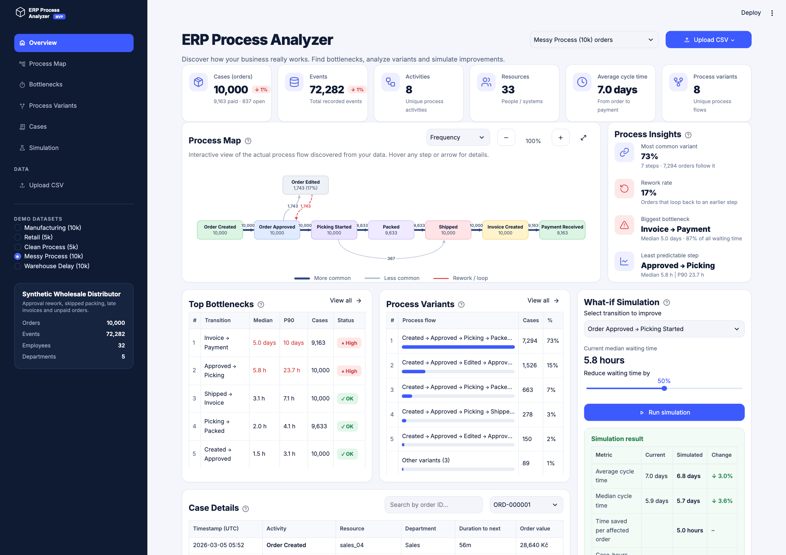

# ERP Process Analyzer

[](https://github.com/ross-workspace/erp-process-simulator/actions/workflows/ci.yml)

A local-first process-mining dashboard for Order-to-Cash event logs. It rebuilds how orders actually moved through an ERP, from creation and approval through picking, shipping, invoicing and payment. It shows where orders wait, which paths deviate from the standard flow, and what shortening one step would have changed.



## What it does

| Page | Answers |
|---|---|
| **Overview** | KPIs with period-over-period change, the discovered process map, headline insights, top bottlenecks, variants, a what-if simulation and a case timeline in one screen. |
| **Process Map** | A directly-follows graph. The main path runs left to right, deviations sit above, skipped steps arc below and loops back are dashed red. Switch between frequency and median-duration labels, filter paths and zoom. |
| **Bottlenecks** | Transitions ranked by share of total waiting time and by P90/median spread, waiting time by receiving department, and weekly started vs. paid orders. |
| **Process Variants** | Every distinct end-to-end path, how many variants cover 95% of orders, a drill-down per variant, and the cycle-time cost of rework. |
| **Cases** | One order event by event (resource, department, time to next step, order value), plus a filterable and exportable order list. |
| **Simulation** | Cut one waiting step by a percentage and see mean and median cycle time, the distribution shift, a sensitivity curve, and case-hours saved per month. |
| **Upload CSV** | Analyze your own export. Includes a format guide, timezone and currency settings, import-quality checks and a sample file. |

## Built-in scenarios

Five deterministic synthetic companies, one click apart in the sidebar, each with a different process shape:

| Dataset | Story |
|---|---|
| Manufacturing (10k) | Make-to-order: material reservation, production, quality-check loops, 30-day payment terms. |
| Retail (5k) | Fast fulfilment, card-like payment within a day or two, cancellations, address corrections and returns after payment. |
| Clean Process (5k) | The standard Order-to-Cash path with no deviations, as a baseline. |
| Messy Process (10k) | Approval rework, skipped packing, late invoices, unpaid orders and payment outliers. |
| Warehouse Delay (10k) | Three in ten approved orders wait one to two days before picking. |

## Run it

Python 3.12+ and [uv](https://docs.astral.sh/uv/) (or plain pip):

```bash
uv sync --extra dev
uv run streamlit run app.py
```

Open http://localhost:8501. No account, API key, database or network connection is needed after installation.

```bash
uv run pytest            # analytics, importer, generator and headless UI tests
```

With Docker:

```bash
docker build -t erp-process-analyzer .
docker run --rm -p 8501:8501 erp-process-analyzer
```

Demo datasets are generated at startup from a fixed seed, so nothing large is committed. To export one:

```bash
uv run python -m erp_process_analyzer.generator --profile manufacturing --cases 10000 --output manufacturing.csv
```

## Use your own event log

Upload a UTF-8 CSV with one row per event:

```csv
case_id,activity,timestamp,resource,department,order_value
ORD-001,Order Created,2026-01-03T08:12:00Z,sales_01,Sales,24500
ORD-001,Order Approved,2026-01-03T09:42:00Z,manager_01,Management,24500
ORD-001,Payment Received,2026-01-19T12:00:00Z,system,Finance,24500
```

`case_id`, `activity` and `timestamp` are required. `resource`, `department`, `cost`, `order_value` and `event_order` are optional. `Payment Received` marks an order complete. In SAP, this kind of log usually comes from sales order (VBAK/VBAP), delivery (LIKP), billing (VBRK) and cleared customer item (BSAD) tables or their CDS views. In Dynamics 365 it comes from sales order, shipment, invoice and payment journals: one event per status change, with the columns renamed. See [the data dictionary](docs/DATA_DICTIONARY.md) for validation rules. Data is processed in the local Streamlit session; if you host the app, uploads are processed on that server.

## How the numbers are made

- Events are ordered within each case by timestamp, optional `event_order`, then source CSV row. Tied timestamps without a unique order are flagged.
- The map is a directly-follows graph: `A → B` means an A event was followed immediately by B in the same case. Hover shows distinct cases and total occurrences separately.
- A completed order reaches its first `Payment Received`. Cycle time runs from its first event to that payment. Open orders stay visible but are excluded from cycle-time and scenario aggregates. Events after payment (e.g. returns) are shown in case details and excluded from process metrics.
- A gap is elapsed calendar time between two events. Median, P90 and total case-hours come from the observed gaps.
- **Bottleneck rating:** *High* if a transition holds over 25% of all waiting time or its P90 is at least 4× its median; *Medium* at over 5% or 2.5×; otherwise *OK*. A long wait is a place to look, not proof of a staffing problem.
- A variant is a full event sequence. A case counts as rework when any activity repeats, such as `Order Approved` → `Order Edited` → `Order Approved`, or a failed quality check sent back to production.
- **Period change** on the KPI cards compares orders created in the second half of the log's window with those created in the first half.
- The **scenario** removes the chosen share of every matching gap from each completed order, assuming later events shift earlier by the same amount, then recomputes mean and median. It does not model capacity, queues, parallel work, payment terms or behaviour change. Case-hours are elapsed order time, not labour hours or money.

## Project layout

```text
app.py                         navigation, sidebar and header (router)
app_pages/                     one script per page
dashboard/                     shared UI: state and caching, panels, HTML components, CSS
src/erp_process_analyzer/      UI-independent analytics package
  importer.py                  CSV validation and normalization
  analyzer.py                  case, transition, variant and rework metrics (vectorized)
  insights.py                  bottleneck ratings, period change, workload, throughput
  scenario.py                  historical timing scenario
  generator.py                 deterministic synthetic company profiles
  visuals.py                   SVG process-map layout and rendering
tests/                         golden fixture, analytics and headless page tests
data/sample_event_log.csv      250-order file for trying the upload flow
docs/                          data contract and screenshot
```

## Deliberate limits

The analysis assumes one order per case and a prepared event log. Real Order-to-Cash systems can have several deliveries, invoices and payments per order and parallel paths; mapping those correctly needs an object-centric data model and is future work. There is no live SAP or Dynamics connector, authentication, database, AI ranking or BPMN editor, and no claim of causal impact.
